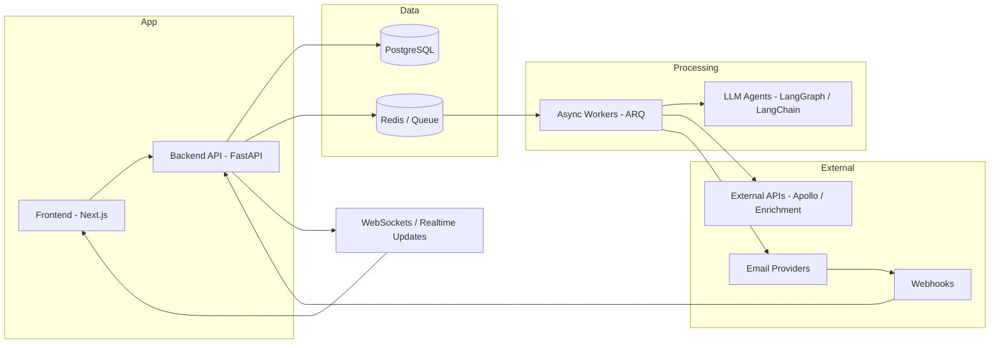

# Agentheon — System Architecture

This document describes the high-level architecture of Agentheon, an AI-powered outbound platform designed to run real-world email campaigns using LLMs and agent workflows.

The focus of this document is on system design, architecture, and trade-offs.  
Implementation details are intentionally omitted.

---

## Overview

Agentheon is designed as a production-grade AI system that combines:

- LLM-based generation (agents)
- External data enrichment (Apollo / APIs)
- Real-time event tracking
- Deliverability-aware execution
- Human-in-the-loop control

The system operates under real-world constraints such as:
- rate limits
- deliverability
- latency
- reliability

---

## High-Level Architecture

---

## Core System Components

### 1. API Layer (FastAPI)

Responsible for:
- campaign orchestration
- user interaction
- state management
- system coordination

Key characteristics:
- async-first design
- stateless execution
- multi-tenant aware

---

### 2. Async Processing Layer (Workers + Queue)

Handles:
- enrichment
- generation
- sending
- tracking

Design choices:
- Redis-backed queue (ARQ)
- decoupled execution from API
- scalable processing model

Trade-offs:
- eventual consistency vs synchronous guarantees
- queue latency vs system responsiveness

---

### 3. Agent Layer (LLM Workflows)

LLM-based agents handle:
- lead research
- context enrichment
- email generation

Built using:
- LangGraph (orchestration)
- LangChain (LLM interaction)

Capabilities:
- multi-step reasoning
- dynamic prompt composition
- structured outputs

---

### 4. Campaign Lifecycle Engine

Campaigns follow a deterministic state machine:

This ensures:
- traceability
- control
- recoverability

---

### 5. Event & Analytics System

Real-time tracking of:
- delivery
- opens
- clicks
- replies
- bounces

Flow:

Design considerations:
- idempotent event processing
- eventual consistency
- real-time UI updates

---

### 6. Multi-Tenant Architecture (BYOA)

Users can bring their own data (e.g. Apollo).

System guarantees:
- strict tenant isolation
- secure API key handling
- scoped data access

---

### 7. Deliverability & Constraints Layer

Outbound systems must operate under strict constraints:

- sending limits
- domain reputation
- warmup requirements
- provider policies

The system is designed to:
- adapt execution dynamically
- prevent account damage
- optimize throughput within safe boundaries

---

## Key Design Principles

### 1. Separation of Concerns
API, processing, and agent logic are fully decoupled.

### 2. Async-First Architecture
All heavy operations run outside the request lifecycle.

### 3. System Observability
The system is designed to expose:
- logs
- metrics
- state transitions

### 4. Deterministic Workflows
Campaign execution is state-driven and reproducible.

### 5. Real-World Constraints First
The system prioritizes:
- reliability over raw output quality
- deliverability over volume
- control over full automation

---

## Trade-offs

| Area | Decision | Trade-off |
|------|---------|----------|
| Async processing | Queue-based workers | Added complexity vs scalability |
| Hybrid agent workflows | Multi-step reasoning | Higher latency vs better outputs |
| Real-time tracking | Webhooks + WebSockets | Eventual consistency vs responsiveness |
| Deliverability constraints | Controlled sending | Lower throughput vs system safety |

---

## What This System Is (and Isn’t)

### ✅ This system is:
- a production AI system
- event-driven
- constraint-aware
- designed for real-world execution

### ❌ This system is not:
- a simple LLM wrapper
- a synchronous API
- a “demo” AI product
