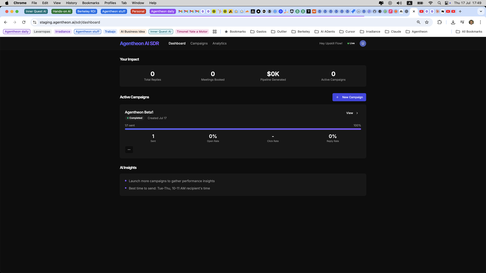
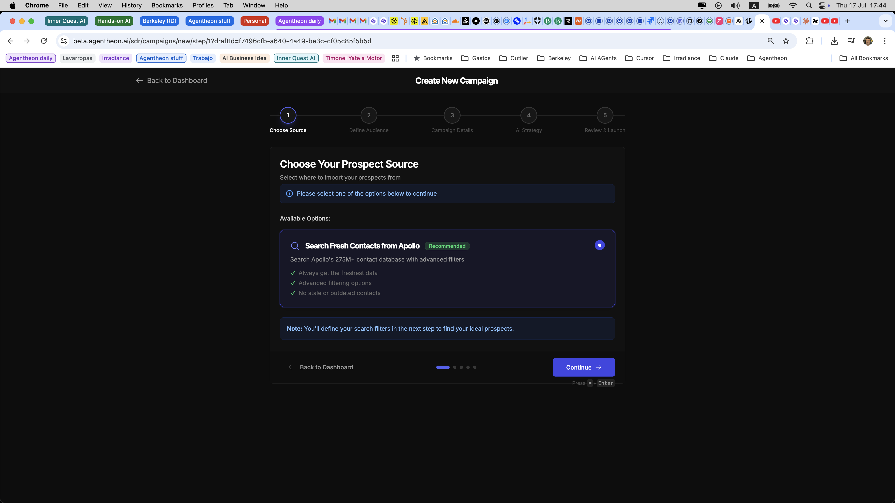
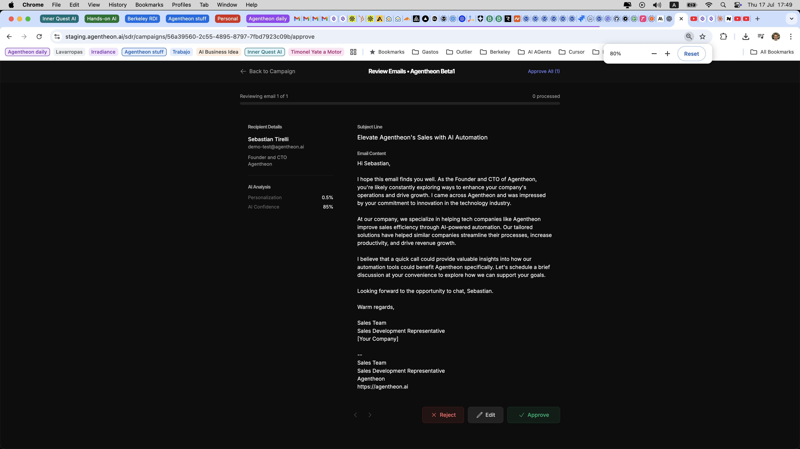

# Agentheon

Production-grade AI SDR platform with a three-tier feedback learning loop. Every sent email becomes training data for the next one — via prompt injection, multi-armed bandits, and semantic memory. No per-customer fine-tuning.

~44K lines of Python, ~11K lines of TypeScript. Built end-to-end by one engineer.

---

## The Differentiator

Every AI SDR tool in 2026 uses the same pattern: static prompt → LLM → send. Quality is fixed at build time.

Agentheon's quality compounds with usage:

| Tier | Mechanism | Where it lives |
|------|-----------|---------------|
| **1 — Prompt injection** | Historical performance stats (top emails, subject patterns, anti-patterns) queried per generation and injected into the prompt | `EmailPerformanceAnalyzer` + `PromptComposer` |
| **2 — Multi-armed bandit** | Thompson Sampling over Beta distributions selects subject line variants. Opens update α atomically. | `SubjectLineBandit` + `subject_variant_stats` table |
| **3 — Semantic memory** | Post-campaign insights embedded (text-embedding-3-small, 512d) and retrieved by audience similarity on future generations | `EmailInsightStore` + pgvector + HNSW |

LangSmith traces every generation. Webhook events feed scores back (reply=1.0, clicked=0.7, opened=0.3, bounced=-1.0) to close the feedback loop at the trace level.

---

## Architecture

```
Browser ──► Next.js (NextAuth proxy) ──► FastAPI ──► ARQ Workers
                                            │            │
                                    ┌───────┴───┐    ┌──┴────────┐
                                    ▼           ▼    ▼           ▼
                             PostgreSQL     Redis Pub/Sub    OpenAI / Tavily
                             (+ pgvector)   (real-time)      Resend / Apollo
                                                   │
                                                   ▼
                                             Socket.IO ──► Browser
```

- **API layer (FastAPI)** — stateless, thin, never blocks on LLM calls. All heavy work enqueued to ARQ.
- **Workers (ARQ)** — controlled parallelism via `asyncio.Semaphore`. Import → Enrich → Generate → Send auto-chain.
- **Agent system (LangGraph 0.2)** — Navigator → Planner → Coordinator. Persistent checkpointing via `AsyncPostgresSaver` survives restarts.
- **Real-time** — Redis Pub/Sub → Socket.IO (Redis adapter) → browser. Sticky sessions on ALB. No polling.
- **Human-in-the-loop** — every draft requires explicit approval; rejections feed LangSmith as negative signal.

Full deep-dive: [ARCHITECTURE.md](./ARCHITECTURE.md).

---

## Tech Stack

| Layer | |
|-------|---|
| Backend | Python 3.11 · FastAPI · SQLAlchemy async · Pydantic · Alembic |
| Frontend | Next.js 13 · TypeScript · React Query v5 · Tailwind · shadcn/ui |
| Database | PostgreSQL 15 · pgvector 0.8 (HNSW) |
| Queue | Redis 7 · ARQ |
| Real-time | Socket.IO · Redis Pub/Sub |
| LLM | OpenAI (gpt-5-mini, text-embedding-3-small) · LangChain · LangGraph · LangSmith |
| Enrichment | Tavily · Perplexity |
| Email | Resend (send + webhooks) |
| Data | Apollo.io |
| Auth | NextAuth (Google OAuth) + HS256 JWT bridge |
| Observability | LangSmith · Sentry · Loguru (PII-sanitized) |
| IaC | Terraform (AWS, ready to apply) |
| CI/CD | GitHub Actions (path-based change detection) |

---

## Production & Deployment

**Currently in production on Railway** — backend + worker containers, managed Postgres + Redis, Git-based auto-deploy from `staging`. The system is live and functional with real campaigns.

**AWS migration fully designed and coded in Terraform.** See [INFRASTRUCTURE.md](./INFRASTRUCTURE.md) for the complete architecture, services list, and cost analysis.

Summary:

| Workload | Service | Why |
|----------|---------|-----|
| API (WebSocket, stateful) | ECS Fargate | Containers handle long-lived connections Lambda can't |
| Workers (30-min jobs) | ECS Fargate | Beyond Lambda's 15-min timeout |
| Webhooks (bursty, stateless) | Lambda + API Gateway HTTP API | Isolate from user traffic, scale automatically |
| Database | RDS PostgreSQL + pgvector | Same engine as Railway, no code changes |
| Cache/queue | ElastiCache Redis | Pub/Sub + ARQ backend |
| Static assets | S3 + CloudFront | Future frontend static migration target |
| Secrets | Secrets Manager + Parameter Store | No secrets in task definitions |
| Observability | CloudWatch | Logs + metrics + alarms |
| Registry | ECR | With lifecycle policies |
| DNS + TLS | Route 53 + ACM | Managed certificates |

Target monthly cost at MVP scale (free-tier aware): **~$60–80**. Full scaling plan through 5,000+ concurrent users with itemized costs in [INFRASTRUCTURE.md](./INFRASTRUCTURE.md).

---

## Engineering Discipline

- Every external API wrapped with retry + exponential backoff (OpenAI, Resend, Tavily, Apollo)
- Webhook idempotency via SHA256 hash in `processed_webhook_events`
- Campaign circuit breaker — auto-pause after 3 consecutive failures
- Connection pool explicitly tuned (size=20, overflow=10, recycle=3600)
- Campaign state changes go through a state machine — direct status updates are forbidden
- Ownership validation on every SDR endpoint (audited)
- 27 Alembic migrations, all auto-generated, constraint-naming-convention enforced
- Fernet encryption for stored API keys and OAuth tokens

---

## Screenshots

### Dashboard


### Campaign Creation


### Email Review (Human-in-the-Loop)


---

## About This Repository

This is a **public architecture overview**. The source code is in a private repository.

Purpose: demonstrate system design, architectural decisions, and production engineering depth without releasing the implementation.

- [ARCHITECTURE.md](./ARCHITECTURE.md) — component design, data flow, trade-offs
- [INFRASTRUCTURE.md](./INFRASTRUCTURE.md) — Railway (current) + AWS (target) deployment with cost analysis
- [ROADMAP.md](./ROADMAP.md) — what's shipped, what's next

---

## Author

Sebastian Tirelli · AI Engineer · [sebastian@agentheon.ai](mailto:sebastian@agentheon.ai)
