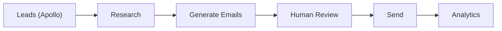

# Agentheon — AI Outbound System

Agentheon is a production-grade AI system that runs real outbound campaigns using LLM agents.

---

## What it does

- Runs end-to-end outbound campaigns (from leads to replies)
- Uses LLM-based agents for research and personalization
- Enforces human-in-the-loop approval before sending
- Operates under real-world constraints (rate limits, domain reputation)
- Tracks delivery, opens, replies, and failures in real time

---

## High-level flow

---

## Why this matters

Most AI outbound tools fail because they ignore system constraints:
- deliverability
- feedback loops
- reliability

Agentheon is designed to operate under those constraints from day one.

---

## System Design

For architecture, trade-offs, and system design details:

👉 [ARCHITECTURE.md](./ARCHITECTURE.md)

---

## About

Built end-to-end by a single engineer:
- system design
- backend
- agent workflows
- infrastructure
